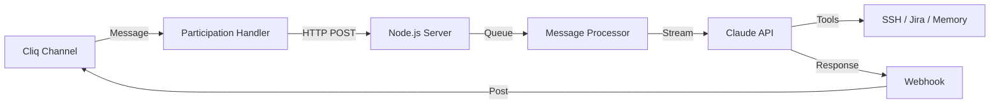

# 🤖 BugBuster 3000

> AI-powered support agent for Zoho Cliq — your 24/7 technical assistant

BugBuster lives in your Cliq channels, helping teams track bugs, investigate issues, and create Jira tickets automatically. Built with Claude Sonnet 4.5 for smart, conversational support.

[](https://opensource.org/licenses/MIT)
[](https://nodejs.org)
[](https://anthropic.com)

---

## ✨ Features

### 🎯 Core Capabilities

- **💬 Conversational AI** — Talks like a teammate, not a bot
- **🎫 Jira Integration** — Automatically creates detailed tickets
- **📸 Image Analysis** — Processes screenshots and error messages
- **🔍 Server Log Access** — Checks remote servers via SSH
- **🧠 Self-Learning** — Saves patterns to memory
- **👥 Group Chat Smart** — Knows when to respond and when to stay silent

### 🛠️ Built For Teams

Perfect for:
- **Support teams** managing bug reports
- **Dev teams** triaging issues in Slack/Cliq
- **Non-technical users** who need help without jargon

---

## 🏗️ Architecture



### How It Works

1. **Message arrives** from Cliq participation handler
2. **Queued per channel** to prevent concurrent API calls
3. **Claude processes** with full conversation history
4. **Tools execute** (SSH logs, Jira tickets, memory updates)
5. **Responses stream** back to Cliq in real-time

### Key Components

| Component | Purpose |
|-----------|---------|
| `src/routes/cliq.js` | Handles Cliq webhooks & message routing |
| `src/services/bugbuster-manager.js` | Manages per-channel sessions & message queue |
| `src/tools/agent-tools.js` | Custom tools (SSH, Jira, memory) |
| `.claude/CLAUDE.md` | System prompt & behavior instructions |

---

## 🚀 Quick Start

### Prerequisites

- Node.js 20+
- Anthropic API key ([get one here](https://console.anthropic.com))
- Zoho Cliq bot
- Jira Cloud instance

### Installation

```bash
# Clone repo
git clone https://github.com/yourusername/bugbuster-3000.git
cd bugbuster-3000

# Install dependencies
npm install

# Create .env file
cp .env.example .env
# Edit .env with your credentials

# Start server
npm start
```

### Docker Deployment

```bash
# Build
docker-compose build

# Run
docker-compose up -d

# Check logs
docker-compose logs -f
```

---

## ⚙️ Configuration

### 1. Environment Variables

Create `.env` file:

```bash
# === REQUIRED ===

# Claude API
ANTHROPIC_API_KEY=sk-ant-xxx

# Cliq Integration
# Bot webhook URL - для отправки сообщений в Cliq
CLIQ_BOT_WEBHOOK_URL=https://cliq.zoho.com/api/v2/bots/bugbuster/incoming?zapikey=xxx

# Jira Integration
JIRA_BASE_URL=https://your-domain.atlassian.net
JIRA_EMAIL=your-email@example.com
JIRA_API_TOKEN=your_jira_api_token
JIRA_PROJECT_KEY=AM

# === OPTIONAL ===

# Server Configuration
PORT=3002
NODE_ENV=production

# Remote Servers (SSH access for diagnostics)
# Format: SERVER_<NAME>_<PROPERTY>
SERVER_SUPABASE_HOST=xxx.xxx.xxx.xxx
SERVER_SUPABASE_USER=root
SERVER_SUPABASE_PASSWORD=your_password

# Add more servers as needed:
# SERVER_PRODUCTION_HOST=prod.example.com
# SERVER_PRODUCTION_USER=admin
# SERVER_PRODUCTION_PASSWORD=your_password
```

### 2. Zoho Cliq Bot Setup

#### Step 1: Create Bot

1. Go to **Zoho Cliq → Bots**
2. Click **Create Bot**
3. Name: `BugBuster 3000`
4. Choose profile picture

#### Step 2: Configure Incoming Webhook

This is how BugBuster sends messages to Cliq:

1. Bot Settings → **Incoming Webhook**
2. Create webhook for your channel
3. Copy webhook URL
4. Add to `.env` as `CLIQ_BOT_WEBHOOK_URL`

**Deluge Function** (routes messages to channel):

```javascript
// Function name: postToChannel
// This runs when BugBuster calls the webhook

response = Map();

// Get message data
text = data.get("text");
channelUniqueName = data.get("channel_unique_name");

// Post to channel as bot
postResult = zoho.cliq.postToChannelAsBot(
    channelUniqueName,
    "bugbuster",  // bot unique name
    text
);

response.put("status", "success");
return response;
```

#### Step 3: Configure Participation Handler

This is how BugBuster receives messages from Cliq:

1. Bot Settings → **Bot Functions** → **Participation Handler**
2. Add this Deluge code:

```javascript
// Get message data
fullMessage = data.get("message");
userName = user.get("first_name");

// Get channel info
channelId = chat.get("id");
channelName = chat.get("name");
if(channelName == null || channelName == "") {
    channelName = chat.get("title");
}

// Your server URL
webhookUrl = "http://YOUR_SERVER:3002/webhook/cliq/participate";

// Send to your server
payload = Map();
payload.put("message_object", fullMessage);
payload.put("user_name", userName);
payload.put("channel_id", channelId);
payload.put("channel_name", channelName);

invokeurl [
    url: webhookUrl
    type: POST
    parameters: payload
];

return Map();  // Don't respond directly
```

#### Step 4: Add Bot to Channel

1. Go to your Cliq channel
2. Type `/invite @BugBuster 3000`
3. Bot will now listen to all messages

---

## 💡 Usage

### Basic Interaction

```
User: hey bugbuster, login page is broken

BugBuster: yo what's happening? what error do u see?

User: "500 internal server error"

BugBuster: ok lemme check the logs
[checking server logs...]
BugBuster: found it - database connection timeout
BugBuster: created ticket AM-42 for devs to check

User: thanks!

BugBuster: np 👍
```

### Creating Tickets

BugBuster automatically creates Jira tickets when issues are reported:

```
User: when users click "submit" button nothing happens

BugBuster: [investigates]
BugBuster: created ticket AM-43: Submit button not responding
```

Tickets include:
- Summary and description
- Reporter name
- Priority (based on conversation)
- Technical details (logs, errors) in Atlassian format

### Checking Server Logs

```
User: can you check if the cron job ran?

BugBuster: lemme check the logs
[queries SSH server]
BugBuster: yeah it ran 2 hours ago, no errors
```

### Staying Silent

BugBuster knows when NOT to respond:

```
User1: hey john going to lunch
User2: ok cool

[BugBuster stays silent - off-topic]
```

---

## 🛠️ Tools

BugBuster has these custom capabilities:

### 1. `server_exec`
Execute SSH commands on remote servers

```javascript
{
  server: "supabase" | "awkward" | "seoengine",
  command: "tail -100 /var/log/app.log | grep error"
}
```

### 2. `create_jira_ticket`
Create Jira tickets

```javascript
{
  summary: "Login page 500 error",
  description: "Users seeing 500 error on /login...",
  priority: "High"
}
```

### 3. `update_memory`
Save learnings to agent memory

```javascript
{
  category: "common-issues",
  content: "Login 500 errors usually mean DB timeout"
}
```

---

## 📊 Scripts

### Bulk Create Tickets from Chat History

Extract bug reports from old chat messages and create Jira tickets:

```bash
# Export chat messages to messages.md
# Then run:
node scripts/create-tickets-from-file.js messages.md
```

**What it does:**
1. Reads chat history from file
2. Uses Claude to extract real issues (filters out casual chat)
3. Creates Jira tickets for each issue
4. Skips already-created tickets and fixed issues

**Example output:**
```
📋 Issues found:
  1. [High] Crawl Site Error - by Inza Khan
  2. [Medium] Unable to assign tickets - by Umair K

🎫 Creating Jira tickets...
  ✅ Created AM-15: Crawl Site Error
  ✅ Created AM-16: Unable to assign tickets

✅ Done!
```

---

## 🐳 Deployment

### Docker Compose

```yaml
version: '3.8'
services:
  bugbuster:
    build: .
    container_name: bugbuster-3000
    restart: unless-stopped
    ports:
      - "3002:3002"
    env_file:
      - .env
    volumes:
      - ./agent-memory.md:/app/agent-memory.md
      - ./.claude:/app/.claude:ro
    healthcheck:
      test: ["CMD", "curl", "-f", "http://localhost:3002/health"]
      interval: 30s
      timeout: 10s
      retries: 3
```

### GitHub Actions CI/CD

Included workflow deploys on push to `main`:

```yaml
name: Deploy to Production
on:
  push:
    branches: [main]

jobs:
  deploy:
    runs-on: ubuntu-latest
    steps:
      - uses: actions/checkout@v4
      - name: Deploy via SSH
        # Syncs code, builds Docker image, restarts service
```

**Required GitHub Secrets:**
- `DEPLOY_SSH_KEY`
- `DEPLOY_HOST`
- All `.env` variables as secrets

---

## 📈 Monitoring

### Health Check

```bash
curl http://localhost:3002/webhook/cliq/health
```

**Response:**
```json
{
  "status": "healthy",
  "service": "Cliq Integration",
  "agent_sdk": {
    "active_sessions": 3,
    "channels": ["CT_123...", "CT_456..."],
    "session_stats": {
      "CT_123...": {
        "total_cost": 0.0142,
        "message_count": 12,
        "created_at": "2026-02-06T10:30:00Z"
      }
    }
  },
  "webhook_configured": true
}
```

### Reset Session

If agent gets confused, reset the channel session:

```bash
curl -X POST http://localhost:3002/webhook/cliq/reset-session/CT_123456
```

---

## 💰 Cost Estimation

Using Claude Sonnet 4.5:

| Usage Type | Estimated Cost |
|------------|----------------|
| Simple query | $0.01 - $0.05 |
| Investigation with logs | $0.10 - $0.30 |
| Deep analysis + ticket | $0.30 - $0.80 |

**Monthly (100 conversations):** ~$10-50

*Sessions persist, so context builds up = lower per-message cost over time*

---

## 🔧 Customization

### Change Personality

Edit `.claude/CLAUDE.md`:

```markdown
## HOW TO TALK:
- text like ur messaging a friend - super casual
- use slang: "lemme", "gonna", "prolly"
- keep it 1-2 lines max
```

### Add New Servers

Edit `.env`:

```bash
SERVER_MYSERVER_HOST=xxx.xxx.xxx.xxx
SERVER_MYSERVER_USER=deploy
SERVER_MYSERVER_PASSWORD="pass"
```

Then update `src/tools/agent-tools.js`:

```javascript
const SERVERS = {
  // ... existing servers
  myserver: {
    host: process.env.SERVER_MYSERVER_HOST,
    username: process.env.SERVER_MYSERVER_USER,
    password: process.env.SERVER_MYSERVER_PASSWORD
  }
};
```

---

## 🐛 Troubleshooting

### Bot Not Responding

**Check service is running:**
```bash
docker ps | grep bugbuster
curl http://localhost:3002/health
```

**Check logs:**
```bash
docker logs bugbuster-3000 --tail=100
```

**Common issues:**
- ❌ Wrong `CLIQ_BOT_WEBHOOK_URL` → verify webhook URL
- ❌ Deluge script not updated → check participation handler
- ❌ Bot not invited to channel → `/invite @BugBuster 3000`

### Messages Not Reaching Cliq

**Test webhook manually:**
```bash
curl -X POST "$CLIQ_BOT_WEBHOOK_URL" \
  -H "Content-Type: application/json" \
  -d '{"text":"test message","channel_unique_name":"general"}'
```

### Agent Gives Generic Responses

**Reset session to clear context:**
```bash
curl -X POST http://localhost:3002/webhook/cliq/reset-session/CHANNEL_ID
```

---

## 📝 System Prompt

BugBuster's personality is defined in [`.claude/CLAUDE.md`](.claude/CLAUDE.md):

- Casual, friendly tone
- No tech jargon with users
- Saves technical details for Jira only
- Stays silent for off-topic chat
- Proactively creates tickets

---

## 🤝 Contributing

Pull requests welcome! For major changes, please open an issue first.

### Development Setup

```bash
npm install
npm run dev  # starts with nodemon
```

### Project Structure

```
bugbuster-3000/
├── src/
│   ├── server.js                      # Express app entry
│   ├── routes/
│   │   ├── cliq.js                    # Cliq webhooks
│   │   └── health.js                  # Health checks
│   ├── services/
│   │   └── bugbuster-manager.js       # Session manager
│   └── tools/
│       └── agent-tools.js             # Custom tools
├── scripts/
│   └── create-tickets-from-file.js    # Bulk ticket creation
├── .claude/
│   └── CLAUDE.md                      # System prompt
├── docker-compose.yml
├── Dockerfile
└── README.md
```

---

## 📄 License

MIT © Awkward Media

---

## 🙏 Acknowledgments

Built with:
- [Anthropic Claude](https://anthropic.com) - AI model
- [Zoho Cliq](https://zoho.com/cliq) - Team messaging
- [Jira](https://atlassian.com/jira) - Issue tracking

---

## 📞 Support

- **Issues**: [GitHub Issues](https://github.com/yourusername/bugbuster-3000/issues)
- **Email**: sasha@awkward-media.com

---

<div align="center">
  <strong>Made with ❤️ for support teams everywhere</strong>
</div>
